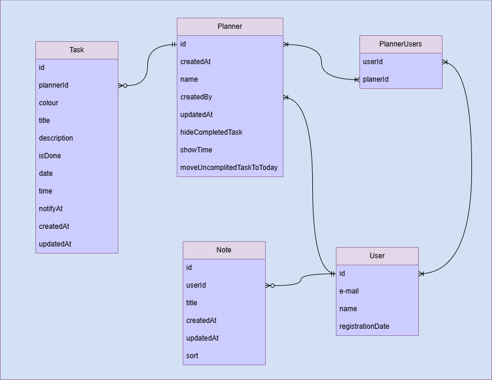

# Planner Wiki
Это приложение для планирования ваших дел. С его помощью можно создавать задачи, привязанные к конкретному дню и времени, а также добавлять заметки и важные ссылки, чтобы ничего не забыть и не потерять. Задачи можно выделять цветом для сортировки. Их можно легко передвигать в любое удобное место. Интерфейс можно настроить по своему вкусу. Этот электронный ежедневник станет незаменимым помощником как для работы, так и для личной жизни!

## Содержание
[Функциональные требования (список фич)](docs/features.md)

[Нефункциональные требования](docs/requirements.md)

### Схема данных

